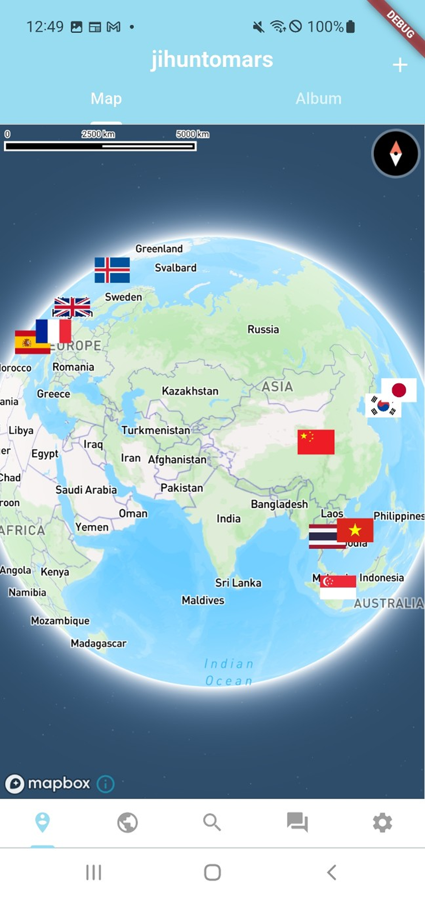
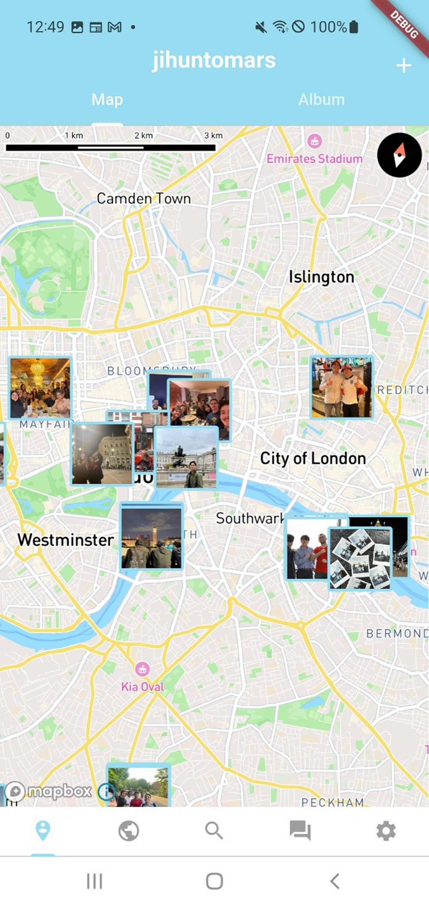
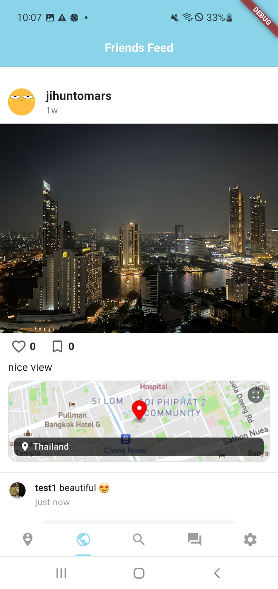
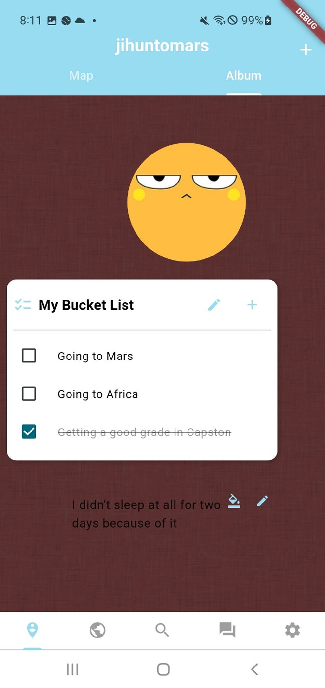
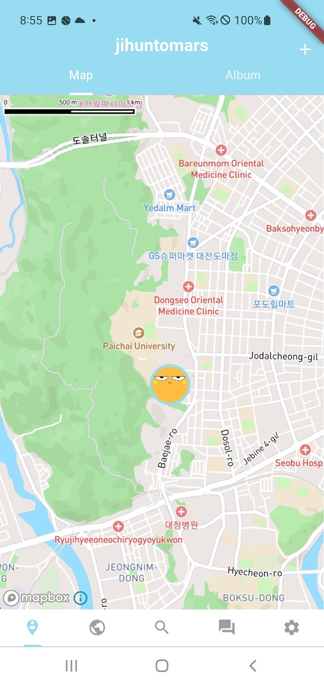
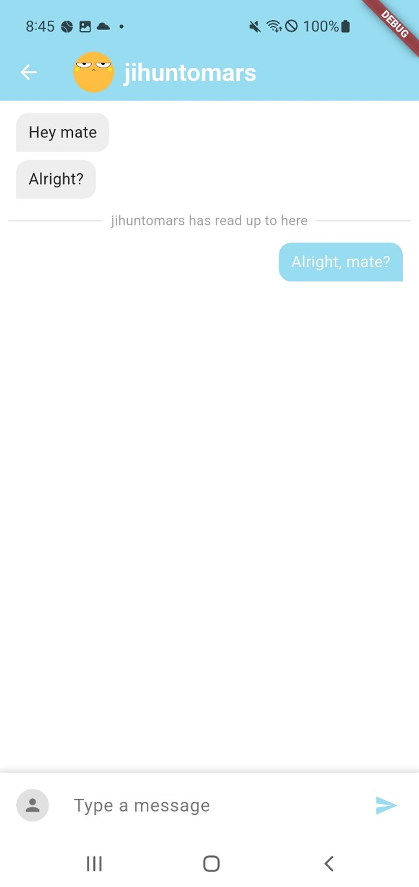
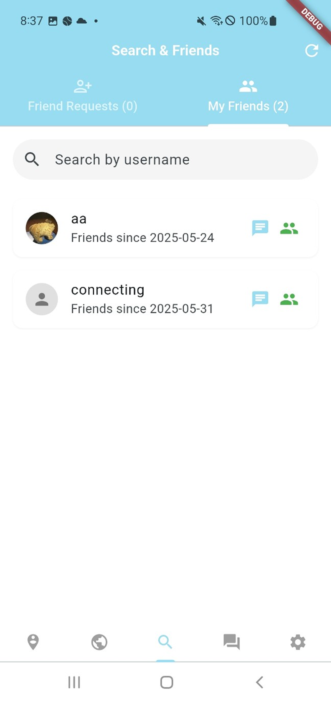

<div align="center">
  

  <h1>Waylo</h1>
  <p><strong>Enjoy Your Trip And Write It Down</strong></p>

  <p>
    
    
    
  </p>
</div>

---

## About

Waylo is a mobile app that lets you record your travel memories on a map, share them with friends, and customize your own album. Pin your photos to the exact location they were taken, track the countries you've visited, and relive your journey — all in one place.

---

## Features

### Map
<div align="center">
  
  
</div>

- Zoom out to view visited countries marked with their national flags
- Zoom in to see photos pinned to their exact GPS coordinates
- Tap any photo pin to view the full post details
- Navigate to your current location with one tap

<br/>

### Feed
<div align="center">
  
</div>

- Browse friends' travel photos in a scrollable feed
- Each post displays the photo, caption, and shooting location on a mini map
- Like and comment on posts
- Set post visibility to public or private when uploading
- Auto-detects photo date from EXIF data
- Manually adjust the photo location using an interactive map picker

<br/>

### Album
<div align="center">
  
</div>

- Customize canvas background color and pattern
- Add and reposition widgets freely on the canvas
- Widgets include: profile image, text box, and bucket list checklist

<br/>

### Location Sharing
<div align="center">
  
</div>

- Display your current location on the map as your profile icon
- Toggle real-time location tracking on or off
- Set a custom location update interval
- Location is only visible to yourself

<br/>

### Chat
<div align="center">
  
</div>

- Direct messaging with friends
- Read receipts to confirm when messages have been seen
- Unread message indicators on the chat list

<br/>

### Friends
<div align="center">
  
</div>

- Search for users by username
- Send and receive friend requests
- View your friends list with the date you became friends
- Access a friend's profile and shared map directly from the list

---

## Tech Stack

| | Technology |
|---|---|
| **Frontend** | Flutter |
| **Backend** | Django REST Framework |
| **Database** | PostgreSQL + PostGIS |
| **Map** | Mapbox |
| **Auth** | Google OAuth |

---

## Getting Started

### Requirements
- Flutter SDK 3.6.1
- Python 3.11.5
- PostgreSQL with PostGIS
- OSGeo4W (for GDAL/GEOS on Windows)

### Backend
```bash
cd waylo_api
pip install -r requirements.txt
python manage.py migrate
python manage.py runserver
```

### Frontend
```bash
cd waylo_flutter
flutter pub get
flutter run
```

---

## Developer

**Jihun Cho**
- GitHub: [@Jihun37](https://github.com/Jihun37)
